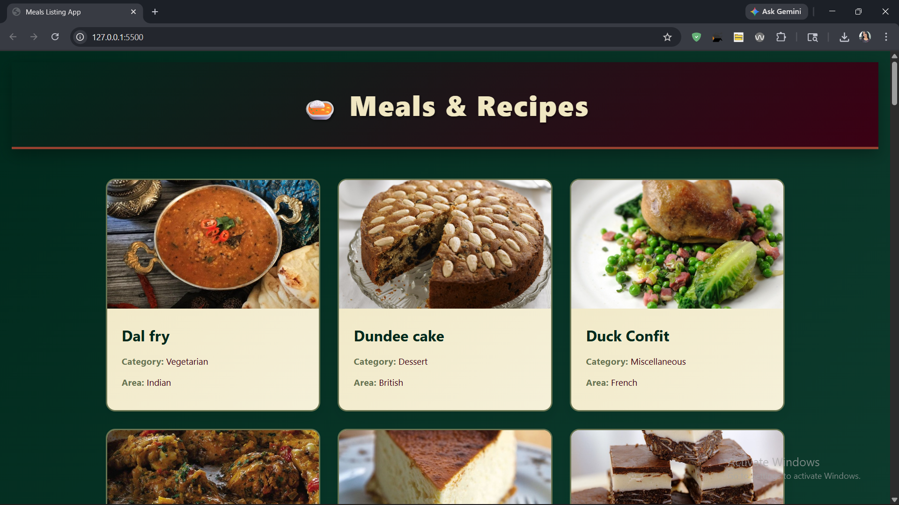

# 🍽️ Meals Listing Interface

A clean and responsive Meals Listing Interface built using HTML, CSS, and JavaScript.  
This project fetches meal data from the FreeAPI Meals API and displays meals in a beautiful card layout for easy browsing.

---

## 🚀 Live Demo

🔗 Live Link: https://meals-listing-interface-indol.vercel.app

---

## 📸 Project Screenshot



---

## ✨ Features

- Fetch meals dynamically from API
- Display meal image, name, category, and area
- Responsive grid layout
- Clean and modern UI
- Loading and error handling
- Simple and easy-to-use interface

---

## 🛠️ Tech Stack

- HTML5
- CSS3
- JavaScript (Vanilla JS)
- FreeAPI Meals API

---

## 🌐 API Endpoint

```bash
https://api.freeapi.app/api/v1/public/meals
```

---

## 📂 Project Setup

```bash
# Clone the repository
git clone https://github.com/rathitanishka-tech/Meals-Listing-Interface.git

# Open project folder
cd meals-listing-interface

# Run with Live Server
```

---

## 📁 Folder Structure

```bash
meals-listing-interface/
│── index.html
│── style.css
│── script.js
│── image.png
└── README.md
```

---

## Built by

Tanishka Rathi
